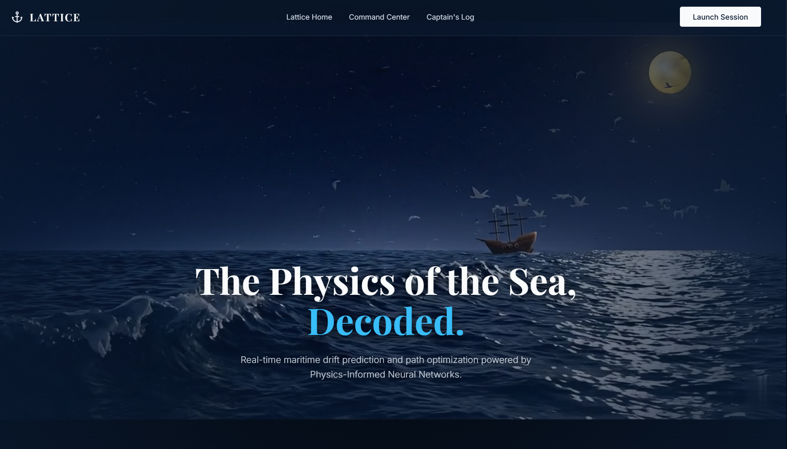
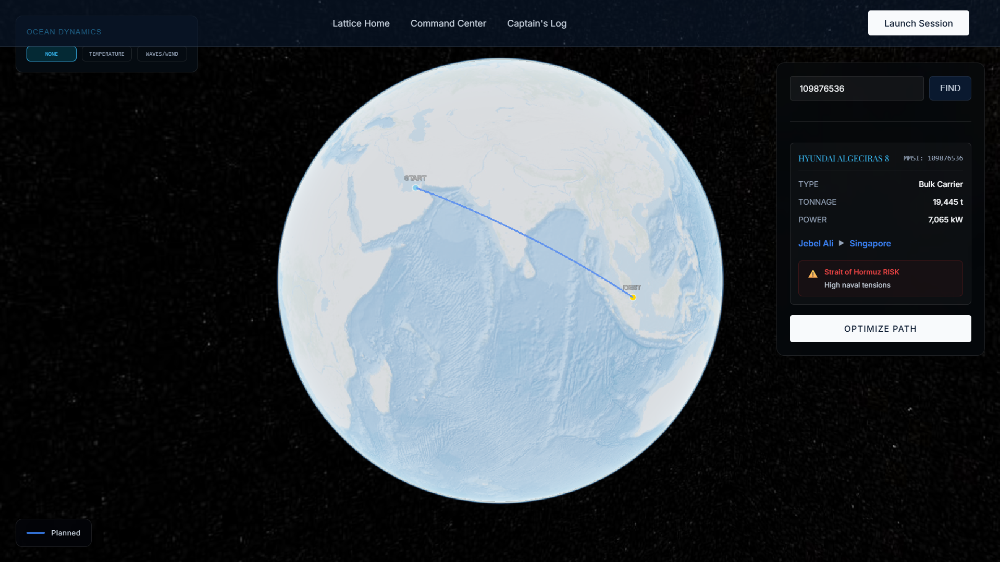
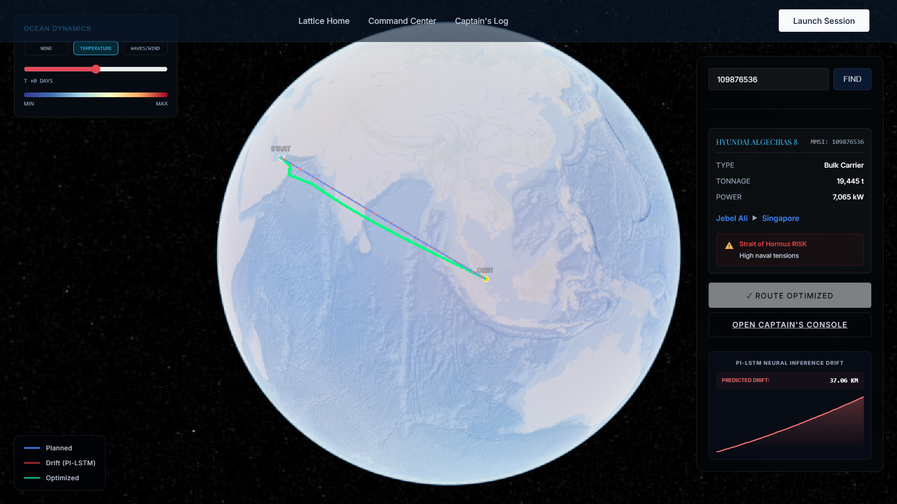
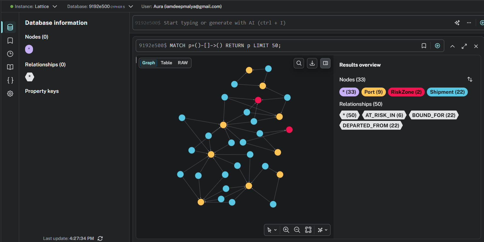

<div align="center">

# 🌊 LATTICE  
### *The Physics of the Sea, Decoded.*



<br/>

[](https://nextjs.org/)
[](https://fastapi.tiangolo.com/)
[](https://pytorch.org/)
[](https://cloud.google.com/)
[](https://cesium.com/platform/cesiumjs/)
[](https://www.docker.com/)

<br/>

### 🚢 AI-Powered Maritime Intelligence & Route Optimization Platform

**Lattice** is a cloud-native maritime intelligence SaaS platform that combines  
**Physics-Informed Deep Learning**, **Ocean Dynamics**, **Geospatial Intelligence**, and **Explainable AI**  
to optimize marine logistics in real time.

</div>

---

# 📖 Overview

Global shipping routes operate under constantly changing environmental forces:
- Ocean currents
- Drift dynamics
- Weather anomalies
- Geopolitical disruptions
- Fuel optimization constraints

Traditional routing systems fail to incorporate the **physics of the sea** directly into prediction pipelines.

Lattice solves this through a **Physics-Informed LSTM (PI-LSTM)** architecture that learns from:
- AIS vessel trajectories
- Oceanographic flow fields
- Environmental forces
- Geopolitical maritime intelligence

while enforcing **real-world physical constraints** during inference.

---

# ✨ Core Features

## 🌊 Physics-Informed AI
Predicts:
- Vessel drift
- Route deviation
- Future positioning
- Ocean-current influence

using:
- Deep learning
- Fluid dynamics constraints
- Ocean physics priors

---

## 🛰️ 4D Digital Twin Simulation
Interactive simulation of vessel behavior across:
- Latitude
- Longitude
- Time
- Environmental dynamics

---

## ⚡ Predictive Route Optimization
Optimizes:
- Fuel consumption
- ETA accuracy
- Route safety
- Environmental efficiency

---

## 🧠 Explainable AI — *Captain’s Log*
Converts complex AI outputs into:
- Human-readable advisories
- Maritime intelligence summaries
- Operational decision support

powered using:
- Gemini LLMs
- LangChain orchestration

---

## 🌍 Interactive Geospatial Dashboard
Built with:
- CesiumJS
- Next.js
- TypeScript

Features:
- Real-time route visualization
- Ocean overlays
- Telemetry monitoring
- Drift analytics
- Optimization overlays

---

## ☁️ Cloud-Native Deployment
Fully containerized microservices architecture using:
- Docker
- Google Cloud Run
- Artifact Registry
- Cloud Build

---

# 🧠 Physics-Informed Learning

Unlike black-box models, Lattice embeds physical constraints directly into training.

## Physics Loss Function

```math
L_{physics} =
\left\|
\frac{d\vec{v}}{dt}
-
(\vec{F}_{engine} + \vec{F}_{drag} + \vec{F}_{current})
\right\|^2
```

## Total Objective

```math
L_{total} =
L_{data-MSE}
+
\lambda_{physics}L_{physics}
+
\lambda_{reg}L_{reg}
```

This ensures:
- physically realistic predictions
- stable trajectory generation
- operational reliability under real ocean conditions

---

# 🏗️ System Architecture

<div align="center">

</div>

---

# 🔄 Process Flow

```text
AIS + Ocean Data + GDELT
            ↓
Data Ingestion Layer
            ↓
Feature Engineering Pipeline
            ↓
Physics-Informed LSTM
            ↓
Drift Prediction & Optimization
            ↓
4D Dashboard Visualization
            ↓
Explainable AI (Captain’s Log)
            ↓
Operational Decision Intelligence
```

---

# 📸 Product Snapshots

---

## 🏠 Landing Experience


---

## 🌍 Dashboard — Raw Route Visualization



---

## ⚡ Optimized Maritime Route



---

## 🧑‍✈️ Captain’s Console


---

## 🧠 Knowledge Graph Intelligence Layer



---

## 📦 Synthetic Shipment Simulation


---

# ⚙️ Technology Stack

# 🖥️ Frontend
- Next.js 16
- React
- TypeScript
- CesiumJS
- CSS Modules

---

# ⚙️ Backend
- FastAPI
- Python
- REST APIs
- Pydantic

---

# 🤖 AI / ML
- PyTorch
- Physics-Informed LSTM (PI-LSTM)
- Custom Physics Loss Functions
- Drift Modeling

---

# 🌊 Data Engineering
- AIS Maritime Data
- Copernicus Marine Datasets
- netCDF4
- Xarray
- GeoPandas
- Polars
- NumPy
- SciPy
- Dask

---

# 🧠 Explainable AI
- Gemini 2.0 Flash
- LangChain

---

# ☁️ Cloud Infrastructure

| Service | Usage |
|---|---|
| Google Cloud Run | Model + Optimizer Deployment |
| Artifact Registry | Container Registry |
| Cloud Build | CI/CD Pipeline |
| Docker | Containerization |
| Google Cloud Storage | Data Layer |

---

# 📁 Project Structure

```bash
Lattice/
│
├── dashboard/                 # Next.js Frontend
│   ├── app/
│   ├── components/
│   ├── public/
│   └── lib/
│
├── services/
│   ├── optimizer/             # Route Optimization Engine
│   ├── wrapper/               # PI-LSTM Inference Service
│   ├── ingestion-gateway/
│   └── risk_scoring_engine/
│
├── scripts/                   # Data Processing Pipelines
├── sim/                       # Simulation Utilities
├── assets/                    # README Visual Assets
│
└── Docker Infrastructure
```

---

# 🚀 Running Locally

# 1️⃣ Clone Repository

```bash
git clone https://github.com/Deepmalya2506/Lattice.git
cd Lattice
```

---

# 2️⃣ Start Optimizer Backend

```bash
cd services/optimizer

docker build -t lattice-optimizer .

docker run -p 8080:8080 lattice-optimizer
```

---

# 3️⃣ Start PI-LSTM Inference Service

```bash
cd services/wrapper

docker build -t lattice-model .

docker run -p 8000:8000 lattice-model
```

---

# 4️⃣ Start Frontend

```bash
cd dashboard

npm install

npm run dev
```

---

# ☁️ Cloud Deployment

## Containerization
- Dockerized microservices
- Independent inference & optimization layers

## Deployment Stack
- Google Cloud Run
- Google Artifact Registry
- Google Cloud Build

## Production Features
- Serverless scaling
- Request-based billing
- Distributed deployment
- Managed container lifecycle

---

# 🌍 Impact

Lattice enables:
- Reduced fuel consumption
- Smarter route optimization
- Better ETA accuracy
- Safer maritime operations
- Explainable operational intelligence
- Sustainable shipping strategies

Potential applications:
- Commercial shipping
- Naval logistics
- Offshore energy operations
- Disaster response coordination
- Maritime surveillance

---

# 🔮 Future Scope

- Reinforcement Learning based optimization
- Carbon-aware route planning
- Real-time IoT vessel telemetry
- Autonomous maritime decision systems
- Defense-grade maritime intelligence
- Supply-demand forecasting for logistics

---

# 🎥 Demo

## 📹 Demo Video
https://drive.google.com/drive/folders/1F2s1jTblN2qGZLi8h8YtU7gnbmS-hogl?usp=sharing

---

# 🌐 Live MVP

## 🚀 Production Deployment
https://lattice-frontend-936844506729.us-central1.run.app

---

# 👨‍💻 Team

## Team ANTARES

Built with:
- AI
- Ocean Physics
- Cloud Infrastructure
- Geospatial Intelligence

---

# 📜 License

This project is licensed under the MIT License.

---

<div align="center">

# 🌌 Final Thought

### *“The ocean is not random.  
It is physics in motion.”*

Lattice transforms maritime logistics from  
static planning → predictive intelligence.

</div>